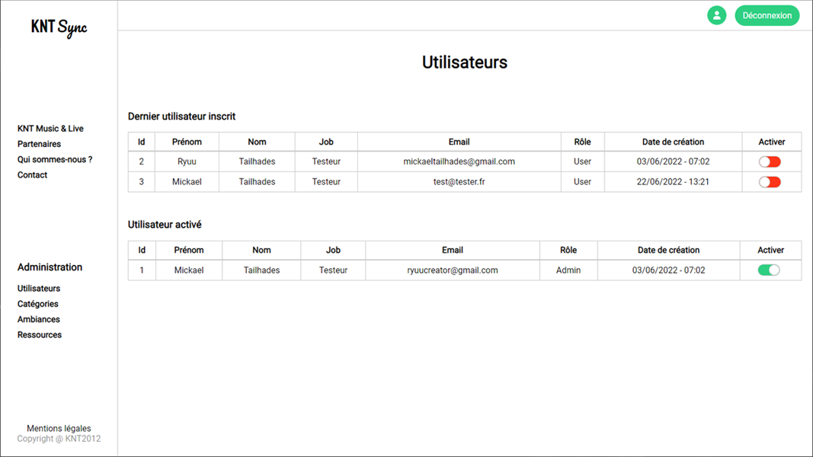

# KNT_Sync
Projet Symfony - Stage

## Description
Lors de mon stage effectué, j’ai développé une solution de partage d’œuvres musicales non-libres de droit pour la société KNT, un professionnel du monde du spectacle.

Pour mener à bien ce projet, nous avons utilisé la stack technique suivante :
- PHP 8
- MySQL v5.7
- Framework Symfony 6 
- ORM - Doctrine
- Moteur de rendu Twig
- Vanilla JS
- CSS Flexbox

La plateforme permet un accès à des ressources protégées. Ces ressources sont administrables depuis un compte utilisateur dédié et des interfaces spécifiques. Elle permet également la création de comptes utilisateurs. Une création de compte nécessite toutefois l’approbation de l’administrateur. 
Un utilisateur a la possibilité de rechercher des ressources par mot-clé. Il peut également effectuer des tris par (plusieurs) catégories/tag.
Le moteur de template Twig, qui est inclus par défaut avec le Framework Symfony, est utilisé pour la création des interfaces.

## Installation

1. Clonez le dépôt : **`git clone https://github.com/RyuuCreator/KNT_Sync`**
2. Installez les dépendances : **`composer install`**
3. Configurez la base de données dans le fichier **`.env`**
4. Créez la base de données : **`php bin/console doctrine:database:create`**
5. Exécutez les migrations : **`php bin/console doctrine:migrations:migrate`**

## Utilisation

Pour lancer le serveur de développement, exécutez la commande suivante :

**`php bin/console server:run`**

Accédez ensuite à votre application dans votre navigateur à l'adresse [http://localhost:8000](http://localhost:8000).

## Screenshots

### Page d'inscription
 
Cette capture d'écran montre la page d'inscription où les utilisateurs peuvent créer un nouveau compte.

### Page de validation des utilisateurs
 
Cette capture d'écran présente la page de validation des utilisateurs où ils peuvent confirmer leur inscription.

### Page d'accueil

Cette capture d'écran illustre la page d'accueil de l'application.

### Page des catégories admin

Cette capture d'écran montre la page des catégories dans l'interface d'administration.

### Page de création de catégorie

Cette capture d'écran présente la page permettant de créer une nouvelle catégorie dans l'interface d'administration.

### Page de création de ressource

Cette capture d'écran présente la page permettant de créer une nouvelle ressource dans l'interface d'administration.

## Auteur

- [Mickael Tailhades](https://github.com/RyuuCreator)
